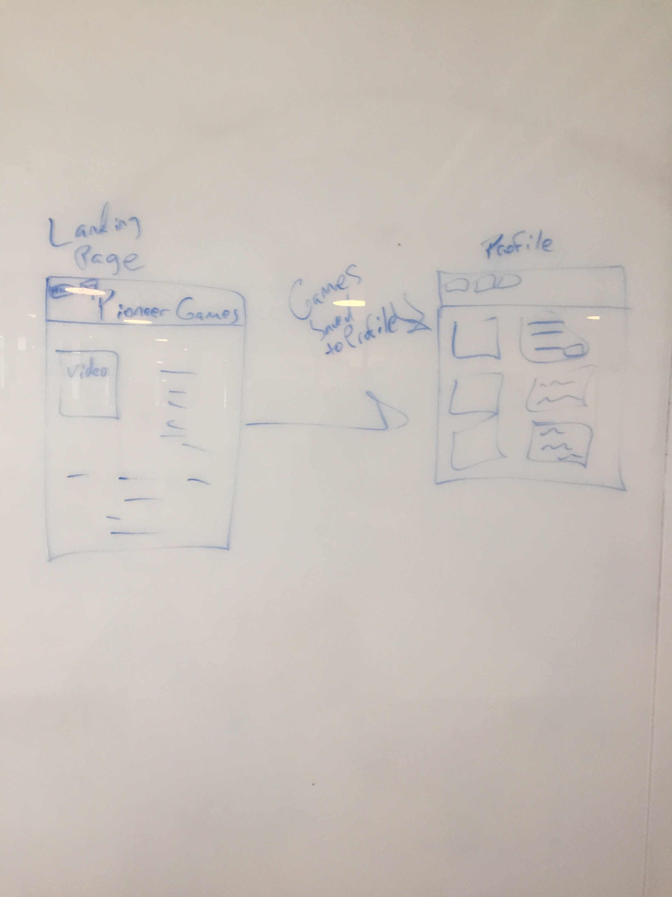

## Pioneer-Gaming

Pioneer Gaming is a website made specifically for you guessed it......GAMERS!

The goal of this website is to provide information of over 11,000 games to anyone. Users can search through the data-base to find a specific game and save it onto a favorite list! Users can create a new game idea and also have the ability to write a review or delete a specific game.

## API
-Mashape API

## FrameWorks Used
- Node.js
- Express
- Mongoose
- Passport
- Morgon
- Cookie Parser
- Body Parser 

## Approach 

This app is meant to be the end all to gamers needs. The app uses an api pulled from Mashape and returns all sorts of info. The user should be able to see game info, game reviews adn current prices of the game.

Another goal this for this app is to build an interactive website community of gamers. Gamers can share reviews and videos of gameplay.

## WireFrame

## Unsolved Problems

Mashape API uses unirest for requests which was difficult to include.

